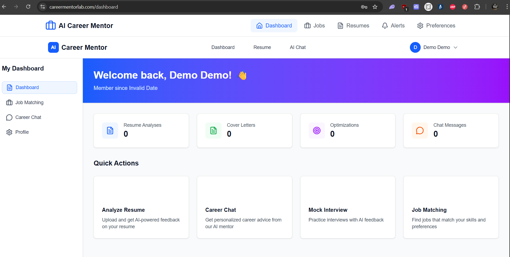

# 🚀 AI Career Mentor Platform

> An intelligent, full-stack career development platform powered by AI that helps job seekers optimize their resumes, generate personalized cover letters, and find their perfect job match.

[](https://opensource.org/licenses/MIT)
[](https://www.python.org/downloads/)
[](https://nextjs.org/)
[](https://fastapi.tiangolo.com/)

## 📋 Table of Contents

- [Features](#-features)
- [Demo](#-demo)
- [Tech Stack](#-tech-stack)
- [Architecture](#-architecture)
- [Getting Started](#-getting-started)
- [Installation](#-installation)
- [Usage](#-usage)
- [API Documentation](#-api-documentation)
- [Project Structure](#-project-structure)
- [Contributing](#-contributing)
- [License](#-license)
- [Contact](#-contact)

## ✨ Features

### 🤖 AI-Powered Resume Analysis
- **Intelligent parsing** of PDF and DOCX resumes
- **ATS (Applicant Tracking System) scoring** with detailed feedback
- **Skills extraction** across multiple categories (technical, soft skills, tools)
- **Experience calculation** and career progression analysis
- **Comprehensive feedback** on format, content, and optimization

### 💬 AI Career Chat Mentor
- **Real-time career guidance** using GPT-4o-mini
- **Conversation history** with session management
- **Context-aware responses** tailored to tech careers
- **Multi-session support** for different topics
- **Persistent chat storage** for reference

### 📝 Personalized Cover Letter Generator
- **AI-generated cover letters** customized to job descriptions
- **Multiple tone options** (Professional, Friendly, Enthusiastic)
- **ATS-optimized content** with keyword matching
- **Professional DOCX export** ready to send
- **Optimization tips** for improvement

### 🎯 Resume Optimization
- **Job-specific optimization** tailored to target positions
- **Keyword enhancement** for better ATS compatibility
- **Professional formatting** with clean templates
- **Achievement quantification** suggestions
- **1-page optimization** for maximum impact

### 💼 Intelligent Job Matching
- **5-factor matching algorithm** (Skills, Experience, Location, Salary, Company)
- **Real-time job fetching** from Adzuna and JSearch APIs
- **Personalized recommendations** based on user profile
- **Advanced filtering** by location, salary, experience level
- **Job application tracking** with status management
- **Save jobs** for later review

### 👤 User Management
- **JWT-based authentication** with secure password hashing
- **User profiles** with career preferences
- **Activity tracking** (resumes analyzed, cover letters generated)
- **Job preferences** and matching settings
- **Resume version management**

## 🎥 Demo

[Live Demo](https://careermentorlab.com) _ https://careermentorlab.com

### Screenshots

**Dashboard**



## 🛠 Tech Stack

### Backend
- **Framework:** FastAPI (Python 3.11+)
- **Database:** SQLite with SQLAlchemy ORM
- **AI/ML:** OpenAI GPT-4o-mini, Custom NLP for parsing
- **Authentication:** JWT tokens with bcrypt
- **Document Processing:** python-docx, PyPDF2
- **Job APIs:** Adzuna API, JSearch API

### Frontend
- **Framework:** Next.js 14 with TypeScript
- **Styling:** Tailwind CSS
- **State Management:** React Context API
- **HTTP Client:** Axios
- **UI Components:** Lucide React icons
- **Form Handling:** React Hooks

### DevOps & Deployment
- **Backend Hosting:** Render
- **Frontend Hosting:** Vercel
- **Database:** Supabase, SQLite (Production: Supabase)
- **Version Control:** Git/GitHub
- **Environment:** dotenv for configuration

## 🏗 Architecture

```
┌─────────────────────────────────────────────────────────┐
│                     Frontend (Next.js)                  │
│  ┌──────────────┐  ┌──────────────┐  ┌──────────────┐   │
│  │  Dashboard   │  │  Chat Page   │  │  Job Search  │   │
│  └──────────────┘  └──────────────┘  └──────────────┘   │
└────────────────────────┬────────────────────────────────┘
                         │ REST API (HTTPS)
┌────────────────────────▼────────────────────────────────┐
│                    Backend (FastAPI)                    │
│  ┌──────────────┐  ┌──────────────┐  ┌──────────────┐   │
│  │   Auth API   │  │   Chat API   │  │   Jobs API   │   │
│  └──────────────┘  └──────────────┘  └──────────────┘   │
│  ┌──────────────┐  ┌──────────────┐  ┌──────────────┐   │
│  │  Resume API  │  │  Profile API │  │  Match Engine│   │
│  └──────────────┘  └──────────────┘  └──────────────┘   │
└────────────────────────┬────────────────────────────────┘
                         │
        ┌────────────────┼────────────────┐
        │                │                │
┌───────▼──────┐ ┌──────▼──────┐ ┌──────▼──────┐
│   Database   │ │  OpenAI API │ │  Job APIs   │
│   (SQLite)   │ │  (GPT-4o)   │ │  (Adzuna)   │
└──────────────┘ └─────────────┘ └─────────────┘
```

## 🚀 Getting Started

### Prerequisites

- **Python 3.11+** installed
- **Node.js 18+** and npm/yarn
- **OpenAI API key**
- **Adzuna API credentials** (optional, for job fetching)
- **Git** for version control

### Environment Variables

Create `.env` file in backend directory:

```env
# OpenAI API
OPENAI_API_KEY=your_openai_api_key_here

# Authentication
SECRET_KEY=your_secret_key_here_change_in_production
ALGORITHM=HS256
ACCESS_TOKEN_EXPIRE_MINUTES=43200

# Job APIs (Optional)
ADZUNA_APP_ID=your_adzuna_app_id
ADZUNA_API_KEY=your_adzuna_api_key
JSEARCH_API_KEY=your_jsearch_api_key

# Database
DATABASE_URL=sqlite:///./career_mentor.db
```

Create `.env.local` file in frontend directory:

```env
NEXT_PUBLIC_API_BASE_URL=http://localhost:8000
```

## 📦 Installation

### 1. Clone the Repository

```bash
git clone https://github.com/Walehdulex/ai-career-mentor.git
cd ai-career-mentor
```

### 2. Backend Setup

```bash
# Navigate to backend directory
cd backend

# Create virtual environment
python -m venv venv

# Activate virtual environment

# On Windows:
venv\Scripts\activate

# On Mac/Linux:
source venv/bin/activate

# Install dependencies
pip install -r requirements.txt

# Create database tables
python -c "from database import create_tables; create_tables()"
```

### 3. Frontend Setup

```bash
# Navigate to frontend directory (from root)
cd frontend

# Install dependencies
npm install
# or
yarn install
```

## 🎮 Usage

### Running the Backend

```bash
# From backend directory with venv activated
python main.py

# Or using uvicorn directly
uvicorn main:app --reload --host 0.0.0.0 --port 8000
```

Backend will be available at: `http://localhost:8000`

API Documentation: `http://localhost:8000/docs`

### Running the Frontend

```bash
# From frontend directory
npm run dev
# or
yarn dev
```

Frontend will be available at: `http://localhost:3000`

### Initial Setup

1. **Navigate to** `http://localhost:3000`
2. **Click "Sign Up"** to create an account
3. **Complete your profile** with career information
4. **Upload a resume** or start chatting with the AI mentor
5. **Set job preferences** to get personalized recommendations

## 📚 API Documentation

### Authentication Endpoints

#### Register User
```http
POST /api/auth/register
Content-Type: application/json

{
  "username": "john_doe",
  "email": "john@example.com",
  "password": "secure_password",
  "full_name": "John Doe"
}
```

#### Login
```http
POST /api/auth/login
Content-Type: application/json

{
  "username": "john_doe",
  "password": "secure_password"
}

Response:
{
  "access_token": "eyJhbGc...",
  "token_type": "bearer",
  "user": {...}
}
```

### Resume Endpoints

#### Upload & Parse Resume
```http
POST /api/upload-resume
Content-Type: multipart/form-data
Authorization: Bearer {token}

file: resume.pdf
```

#### Analyze Resume
```http
POST /api/analyze-resume
Content-Type: application/json
Authorization: Bearer {token}

{
  "resume_data": {parsed_resume_object}
}
```

### Chat Endpoints

#### Send Message
```http
POST /api/chat
Content-Type: application/json
Authorization: Bearer {token}

{
  "message": "How do I transition to a software engineering role?",
  "session_id": "optional_session_id"
}
```

#### Get Chat History
```http
GET /api/chat/sessions
Authorization: Bearer {token}
```

### Job Matching Endpoints

#### Get Job Recommendations
```http
GET /api/jobs/recommendations?limit=20&min_score=60
Authorization: Bearer {token}
```

#### Search Jobs
```http
GET /api/jobs/search?query=developer&location=London&remote_type=remote
Authorization: Bearer {token}
```

#### Save Job
```http
POST /api/jobs/{job_id}/save
Authorization: Bearer {token}
```

For complete API documentation, visit `http://localhost:8000/docs` when running the backend.

## 📁 Project Structure

```
ai-career-mentor/
│
├── backend/
│   ├── .venv/                          # Virtual environment
│   ├── __pycache__/                    # Python cache
│   ├── tests/                          # Test files
│   ├── uploads/
│   │   └── resumes/                    # Uploaded resume storage
│   ├── __init__.py                     # Package initializer
│   ├── .career_mentor.db               # SQLite database (dev)
│   ├── .env                            # Environment variables (local)
│   ├── .gitignore                      # Git ignore rules
│   ├── auth.py                         # JWT authentication & user management
│   ├── career_mentor.db                # Main SQLite database
│   ├── database.py                     # Database configuration & session
│   ├── email_service.py                # Email notification service
│   ├── enhanced_resume_parser.py       # AI-powered resume parsing
│   ├── fix_jobs.py                     # Job data cleanup utilities
│   ├── job_api_service.py              # Adzuna API integration
│   ├── job_matching.py                 # 5-factor matching algorithm
│   ├── main.py                         # FastAPI application entry point
│   ├── migrate_database.py             # Database migration scripts
│   ├── render.yaml                     # Render deployment config
│   ├── requirements.txt                # Python dependencies
│   ├── resume_parser.py                # Resume extraction logic
│   └── test_matching.py                # Matching algorithm tests
│
├── frontend/
│   ├── .next/                          # Next.js build output
│   ├── lib/                            # Utility libraries
│   ├── node_modules/                   # NPM dependencies
│   ├── public/                         # Static assets
│   ├── src/
│   │   ├── app/
│   │   │   ├── admin/                  # Admin dashboard
│   │   │   ├── auth/                   # Authentication pages
│   │   │   ├── chat/                   # AI chat interface
│   │   │   ├── components/
│   │   │   │   ├── auth/               # Auth components
│   │   │   │   ├── layout/             # Layout components
│   │   │   │   ├── AuthForms.tsx       # Login/Register forms
│   │   │   │   ├── DashboardNav.tsx    # Navigation component
│   │   │   │   └── UserDashboard.tsx   # Main dashboard component
│   │   │   ├── contexts/               # React contexts
│   │   │   ├── dashboard/
│   │   │   │   ├── alerts/             # Job alerts management
│   │   │   │   ├── jobs/               # Job listings & search
│   │   │   │   ├── resumes/            # Resume management
│   │   │   │   ├── layout.tsx          # Dashboard layout
│   │   │   │   └── page.tsx            # Dashboard home (2 issues)
│   │   │   ├── login/                  # Login page
│   │   │   ├── profile/                # User profile
│   │   │   ├── register/               # Registration page
│   │   │   ├── resume/                 # Resume upload/analysis
│   │   │   ├── test-api/               # API testing page
│   │   │   ├── favicon.ico             # Site favicon
│   │   │   ├── globals.css             # Global styles
│   │   │   ├── layout.tsx              # Root layout
│   │   │   └── page.tsx                # Home page
│   │   ├── .env.local                  # Local environment variables
│   │   ├── .env.production             # Production environment variables
│   │   ├── .gitignore                  # Git ignore rules
│   │   ├── eslint.config.mjs           # ESLint configuration
│   │   ├── next-env.d.ts               # Next.js TypeScript declarations
│   │   ├── next.config.js              # Next.js configuration
│   │   ├── next.config.ts              # Next.js TypeScript config
│   │   ├── package-lock.json           # NPM lock file
│   │   ├── package.json                # NPM dependencies & scripts
│   │   ├── postcss.config.mjs          # PostCSS configuration
│   │   ├── README.md                   # Frontend documentation
│   │   ├── tsconfig.json               # TypeScript configuration
│   │   ├── vercel.json                 # Vercel deployment config
│   │   ├── .gitignore                  # Additional git ignore
│   │   ├── image.png                   # Project image (U)
│   │   ├── README.md                   # Root documentation (M)
│   │   └── requirements.txt            # Additional requirements
│
└── README.md                           # Main project documentation
```

## 🔑 Key Features Implementation

### Resume Parsing Algorithm
```python
# Enhanced parsing with NLP
- PDF/DOCX text extraction
- Section identification (Experience, Education, Skills)
- Named Entity Recognition for companies and roles
- Skill categorization (Technical, Soft, Tools, Languages)
- ATS scoring based on 10+ factors
```

### Job Matching Algorithm
```python
# 5-Factor Weighted Scoring
scores = {
    'skills': 0.35,      # 35% - Technical skill alignment
    'experience': 0.25,  # 25% - Experience level match
    'location': 0.20,    # 20% - Location preference
    'salary': 0.10,      # 10% - Salary expectation fit
    'company': 0.10      # 10% - Company preference
}
```

## 🧪 Testing

### Backend Tests
```bash
# Install pytest
pip install pytest pytest-cov

# Run tests
pytest tests/ -v

# With coverage
pytest tests/ --cov=. --cov-report=html
```

### Frontend Tests
```bash
# Install testing libraries
npm install --save-dev @testing-library/react @testing-library/jest-dom

# Run tests
npm test
```

## 🚀 Deployment

### Backend (Render)
1. Create new Web Service on Render
2. Connect GitHub repository
3. Set build command: `pip install -r requirements.txt`
4. Set start command: `uvicorn main:app --host 0.0.0.0 --port $PORT`
5. Add environment variables
6. Deploy

### Frontend (Vercel)
1. Import project to Vercel
2. Select Next.js framework
3. Add environment variables
4. Deploy


## 📝 License

This project is licensed under the MIT License - see the [LICENSE](LICENSE) file for details.

## 🙏 Acknowledgments

- **OpenAI** for GPT-4o-mini API
- **Adzuna** for job listing API
- **FastAPI** community for excellent documentation
- **Next.js** team for the amazing framework
- All contributors and supporters

## 📧 Contact

**Developer:** Dulex  
**Email:** your.email@example.com  
**LinkedIn:** [linkedin.com/in/yourprofile](https://www.linkedin.com/in/abdullahi-a-37a0b4109/)  
**Project Link:** [github.com/Walehdulex/ai-career-mentor](https://github.com/Walehdulex/ai-career-mentor)

---

## 🗺 Roadmap for the future

### Q1 2026
- [ ] Mock interview simulator with voice recognition
- [ ] LinkedIn profile optimization
- [ ] Company culture matching
- [ ] Mobile app (React Native)

### Q2 2026
- [ ] Salary negotiation coach
- [ ] Career path predictor using ML
- [ ] Integration with more job boards
- [ ] Team/enterprise features

### Q3 2026
- [ ] Video interview practice
- [ ] Skill gap analysis with course recommendations
- [ ] Networking event finder
- [ ] Mentorship matching

---

## License

Copyright (c) 2025 ABDULLAHI - AI Career Mentor. All Rights Reserved.

This software is proprietary and confidential. Unauthorized copying, 
distribution, or use is strictly prohibited.

**Created and Developed by ABDULLAHI**

*Building the future of AI-powered career development*
